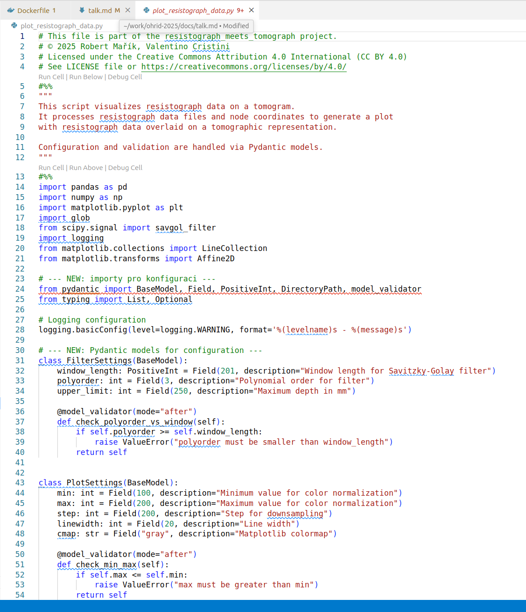
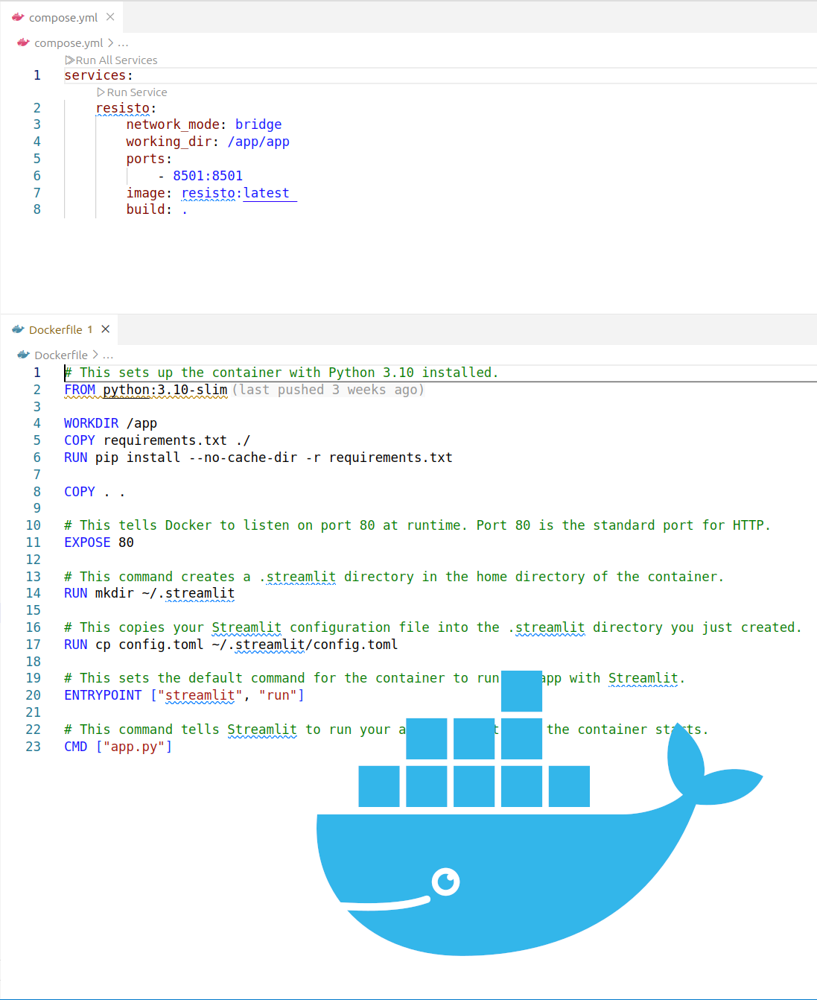

<!-- footer:  -->

# Resistograph meets tomograph

Robert Mařík & Valentino Cristini
Mendel University in Brno

---

# Content of the talk

- Resistograph and tomograph: strengths and limitations
- Combined approach: a Python library to merge data from both devices
- Vibe coding in 2025 (ChatGPT)
- Code sharing in 2025 (Docker)

---

# Tomograph

- fast and reliable tool for stem inspection
- global information from the whole cross section
- shows the size and shape of the internal defects
- cracks are reported as cavities

---

# Resistograph

- scans the power required to microdrilling at given speed
- measures mechanical properties of the material
- local information

---

# Merge data I

- Transform resistograph data to 2D geometry of the cross section
- Visualize the data in the new geometry

---

# Merge data II

- merge resistograph data with tomograph data
- visualize the merged data
- look for short or long decreases in resistograph data. This indicates cracks and cavities, respectively

---

# Python library

- language widely used in scientific data processing
- many libraries for data processing and visualization
- easy to automate, scale, modify, share and reuse
- easy to integrate with other tools

---

# Python library

Limitations

- requires programming skills
- requires installation of Python, Python IDE and libraries
- no GUI

---

# Streamlit

- library for building web apps
- requires minimal code
- interactive widgets for user input
- real-time updates
- widely used in data science and machine learning, in industry and academia

---

# Vibe coding

- ChatGPT 5 on August 2025
- web app in two prompts

~~~
Mam nasledujici knihovnu. Napis streamlit 
program, ktery umozni nahrat zazipovany 
adresar s daty a spusti na nem prikazy 
odpovidajici main funkci. Vystup se zobrazi.
~~~

~~~
OK. V levem panelu chci mit moznost menit 
prednastavene volby.
~~~

---

# Docker

A containerization platform
- packages application and its dependencies into a container
- ensures consistency across different environments
- easy to share and deploy
- widely used in industry, academia, research

---

# Run dockerized app

~~~
docker compose up
~~~

- 🚫 No Python install
- 🚫 No dependency issues
- 🖥️ Works on Win / Mac / Linux
- 📂 Just clone repo with `Dockerfile` and `docker-compose.yml`
- ⏳ First run = minutes, later = ms

---

# Summary

- Resistograph and tomograph are complementary tools for tree stem inspection
- A Python library was developed to simplify data merging and visualization
- GUI for Python is possible with Streamlit
- Installation can be made simple and repeatable with Docker

