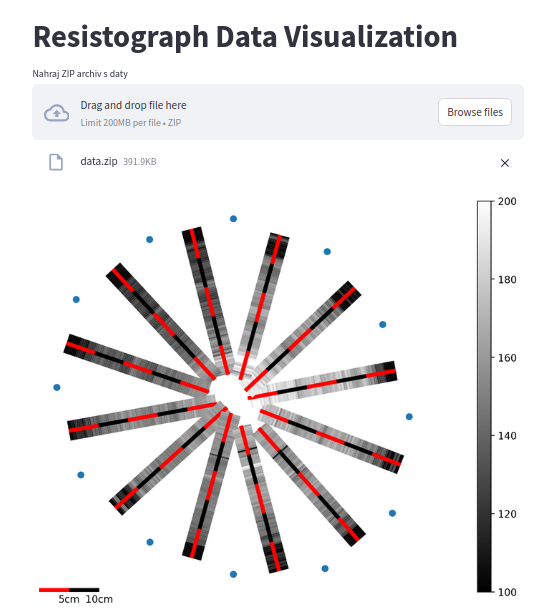

# Resistograph meets tomograph

Robert Mařík & Valentino Cristini
Mendel University in Brno

---
<!-- no-fragment -->

# Content of the talk

* Resistograph and tomograph: strengths and limitations
* Combined approach
* Technical note 1: vibe coding in 2025 (ChatGPT)
* Technical note 2: code sharing in 2025 (Docker)

---
<!-- no-fragment -->

# Resistograph

* scans the power required to microdrilling at given speed
* measures mechanical properties of the material
* local information

---
<!-- no-fragment -->

# Tomographs

* gives overviee of the whole cross section
* 

---
<!-- no-fragment -->

# Merge data

---
<!-- no-fragment -->

# Vibe coding with ChatGPT (1/2)

~~~
Mam nasledujici knihovnu. Napis streamlit program, 
ktery umozni nahrat zazipovany adresar s daty a spusti na nem 
prikazy odpovidajici main funkci. Vystup se zobrazi.
~~~

---

# Vibe coding with ChatGPT (2/2)
<!-- no-fragment -->

~~~
OK. V levem panelu chci 
mit moznost menit prednastavene volby.
~~~

---
<!-- no-fragment -->

~~~
docker compose up
~~~