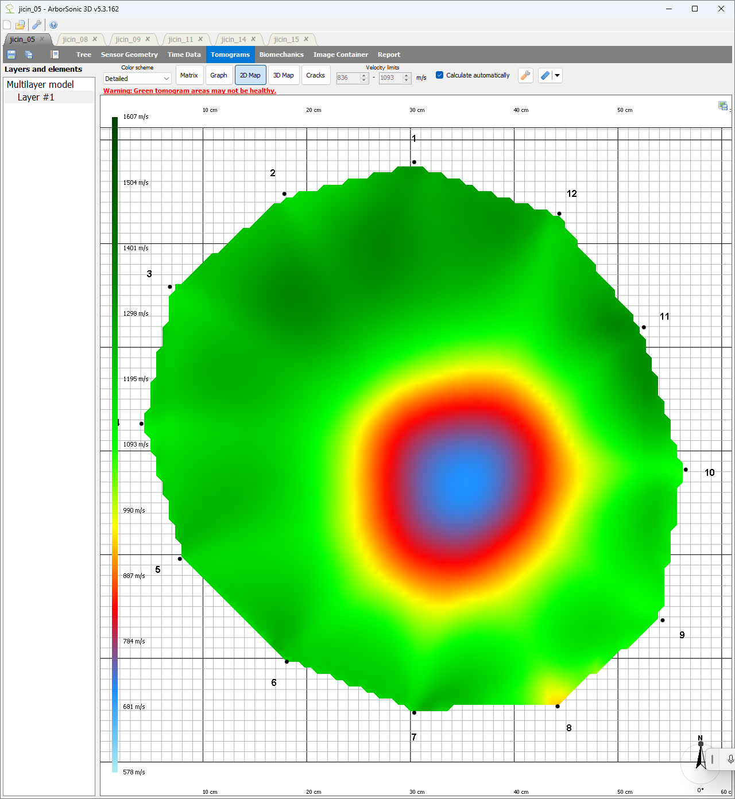
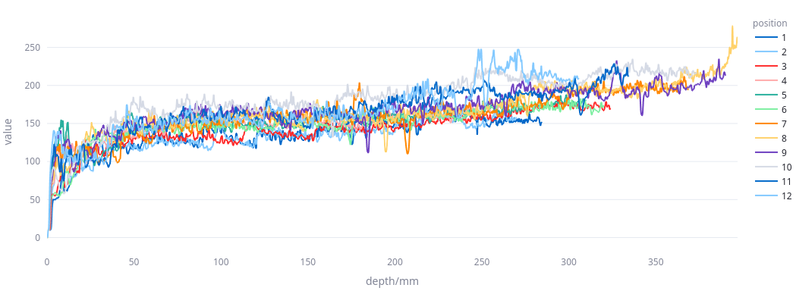
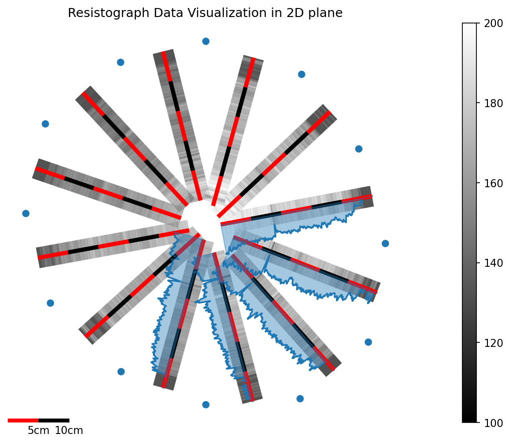
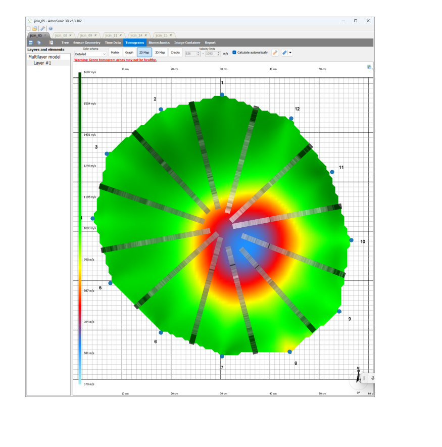
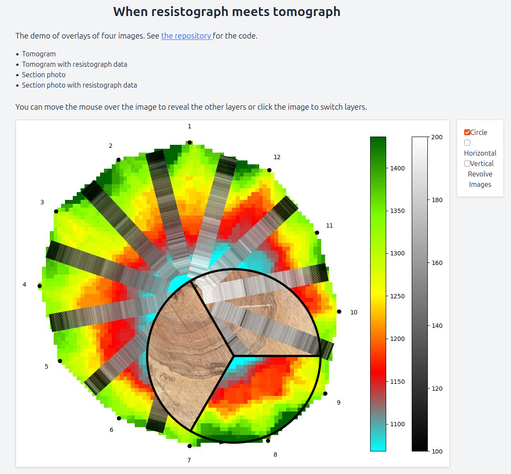
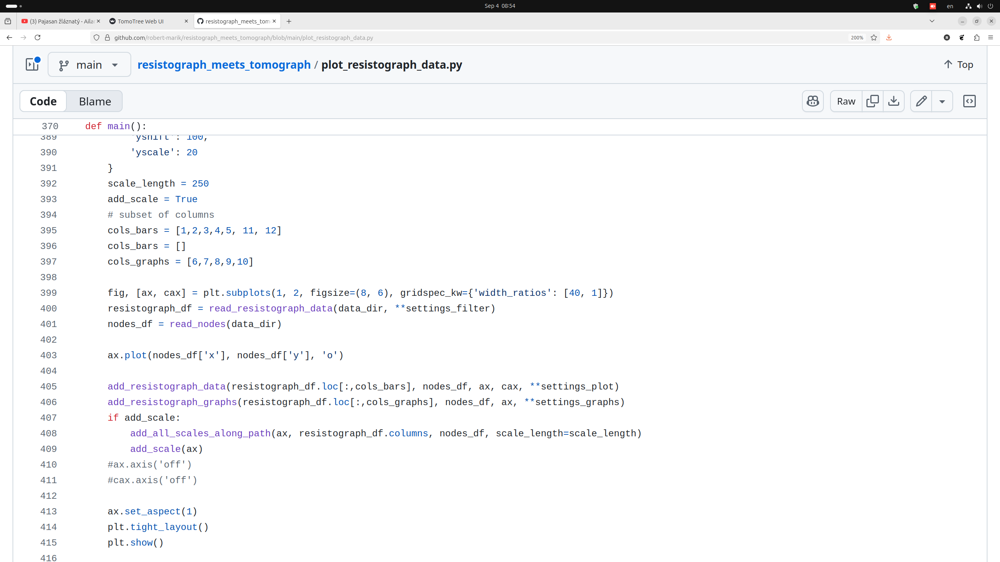
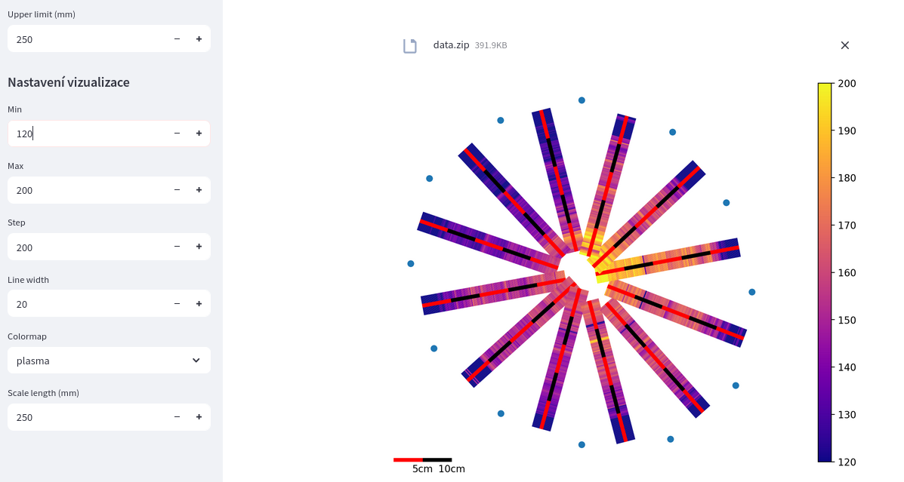

# Resistograph meets tomograph

Robert Mařík & Valentino Cristini
Mendel University in Brno

---

# Content of the talk

- Resistograph and tomograph: strengths and limitations
- Combined approach: a Python library to merge data from both devices
- Technical note 1: vibe coding in 2025 (GUI via ChatGPT)
- Technical note 2: code sharing in 2025 (Docker)

---

# Tomograph

- fast and reliable tool for stem inspection
- global information from the whole cross section
- shows the size and shape of the internal defects
- cracks are reported as cavities

---

# Resistograph

- scans the power required to microdrilling at given speed
- measures mechanical properties of the material
- local information

---
<!-- no-fragment -->

# Merge data I

- Transform resistograph data to 2D geometry of the cross section
- Visualize the data in the new geometry

---
<!-- no-fragment -->

# Merge data II

- Merge resistograph data with tomograph data.
- Visualize the merged data.
- Look for short or long decreases in resistograph data. This indicates cracks and cavities, respectively.

---
<!-- no-fragment -->

# Python library

Advantages

- language widely used in scientific data processing
- many libraries for data processing and visualization
- easy to automate, scale, modify, share and reuse
- easy to integrate with other tools

---
<!-- no-fragment -->

# Python library

Limitations

- requires programming skills
- requires installation of Python, Python IDE and libraries
- no GUI

---

# User complaints

- Want to use a GUI. No coding.
- Need simple installation.
- Need easy sharing.

---

# Streamlit

- Python library for building web applications
- easy to use, requires minimal code
- interactive widgets for user input
- real-time updates
- free hosting on Streamlit Cloud
- widely used in data science and machine learning communities
- widely used in industry and academia

Btw: what exactly does it mean "easy to use"?

---

# Vibe coding with ChatGPT 

- ChatGPT 5 on August 2025
- communication in Czech
- web app in 2 prompts

~~~
Mam nasledujici knihovnu. Napis streamlit 
program, ktery umozni nahrat zazipovany 
adresar s daty a spusti na nem prikazy 
odpovidajici main funkci. Vystup se zobrazi.
~~~

~~~
OK. V levem panelu chci mit moznost menit 
prednastavene volby.
~~~

---

# Docker

A containerization platform
- packages application and its dependencies into a container
- ensures consistency across different environments
- easy to share and deploy
- widely used in industry and academia
- starts a container with a single command in miliseconds

---

# Running dockerized app

~~~
docker compose up
~~~

Advantages

- 🚫 No Python install
- 🚫 No dependency issues
- 🖥️ Works on Win / Mac / Linux
- 📂 Just clone repo with `Dockerfile` and `docker-compose.yml`
- ⏳ First run = minutes, later = ms

---

# Summary

- Resistograph and tomograph are complementary tools for tree stem inspection
- Merging data from both devices provides a more comprehensive understanding of stem condition
- A Python library was developed to facilitate data merging and visualization
- Streamlit can be used to create a user-friendly web application for non-programmers
- Docker ensures easy installation across different systems

